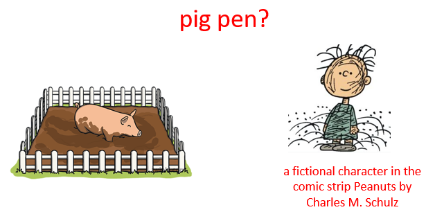
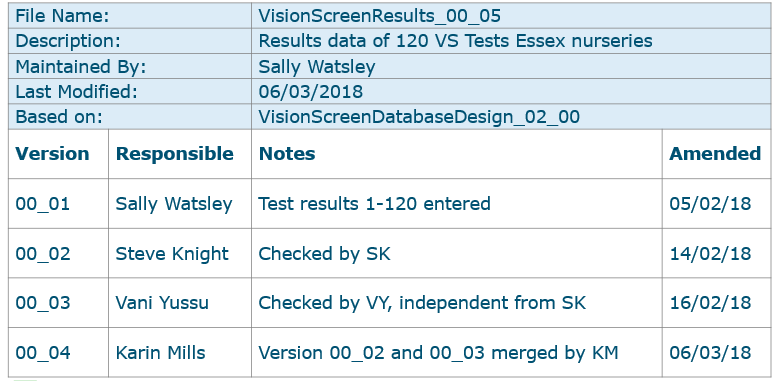

**FAIR data guidelines for pig research**

**Deliverable 3.3**

|                                                                                           |
|-------------------------------------------------------------------------------------------|
| Start date of the project: March 1st, 2021                                     |
| Duration: 60 months                                                                       |
| Deliverable Title: FAIR data guidelines for pig research                                  |
| Deliverable Number: D3.3                                                                  |
| Deliverable Lead: Rob Lokers                                                              |
| Related Work package: WP3                                                                 |
| Author(s): Rob Lokers, Hendrik Boogaard, Catherine Hurtaud, Nina Melzer, Catherine Larzul |
| Contributor(s): Claudia Kasper, Sarah Fischer                                             |
| Communication level: PU                                                                   |
| Due date: M24                                                                             |
| Actual submission date: M29                                                               |
| Revision: V1                                                                              |

# Contents

[1 General introduction](#general-introduction)

[2 Open Science](#open-science)

[2.1 Definition of Open Science](#definition-of-open-science)

[2.2 What to do and why?](#what-to-do-and-why)

[2.3 Useful links on Open Science](#useful-links-on-open-science)

[3 FAIR principles](#fair-principles)

[3.1 Introduction](#introduction)

[3.2 Open Data](#open-data)

[3.3 FAIR principles and Fair Data
sharing](#fair-principles-and-fair-data-sharing)

[3.3.1 Reasons to comply with FAIR](#reasons-to-comply-with-fair)

[3.3.2 Making Data Findable](#making-data-findable)

[3.3.3 Making Data Accessible](#making-data-accessible)

[3.3.4 Making Data Interoperable](#making-data-interoperable)

[3.3.5 Making Data Re-usable](#making-data-reusable)

[3.4 Some myths and misunderstandings around
FAIR](#some-myths-and-misunderstandings-around-fair)

[3.5 Useful links on FAIR data
sharing](#useful-links-on-fair-data-sharing)

[4 Metadata and data
standardization](#metadata-and-data-standardization)

[4.1 Definition of metadata](#definition-of-metadata)

[4.2 Common metadata](#common-metadata)

[4.2.1 Introduction to Dublin Core
(DC)](#introduction-to-dublin-core-dc)

[4.2.2 Highly recommended elements of the Dublin
Core](#highly-recommended-elements-of-the-dublin-core)

[4.2.3 Recommended elements of DC](#recommended-elements-of-dc)

[4.2.4 Restrictions and limitations of
DC](#restrictions-and-limitations-of-dc)

[4.2.5 Example of a dataset published in
Zenodo](#example-of-a-dataset-published-in-zenodo)

[4.3 Data and metadata
standardization](#data-and-metadata-standardization)

[4.3.1 Introduction](#introduction-1)

[4.3.2 Additional standardisation](#additional-standardisation)

[4.3.3 Short insight into the ABCD standard (“Access to Biological
Collections
Data”)](#short-insight-into-the-abcd-standard-access-to-biological-collection-data)

[4.4 Useful links on meta-/data and
standardization](#useful-links-on-meta-data-and-standardization)

[5 Ontologies](#ontologies)

[5.1 Introduction](#introduction-2)

[5.2 ATOL ontology](#atol-ontology)

[5.3 Examples of annotation of data in
publications](#examples-of-annotation-of-data-in-publications)

[5.4 Annotation of data: how to
proceed?](#annotation-of-data-how-to-proceed)

[5.5 Useful links on ontologies](#useful-links-on-ontologies)

[6 Data curation](#data-curation)

[6.1 Introduction](#introduction-3)

[6.2 Organisation and storing data](#organisation-and-storing-data)

[6.2.1 Folder and files](#folder-and-files)

[6.2.2 Relational databases](#relational-databases)

[6.3 Data quality](#data-quality)

[6.3.1 General aspects](#general-aspects)

[6.3.2 Data plausibility examples -
introduction](#data-plausibility-examples---introduction)

[6.3.3 Data plausibility examples - formatting
problems](#data-plausibility-examples---formatting-problems)

[*6.3.4* Data plausibility examples - checking individual
variables](#data-plausibility-examples---checking-individual-variables)

[*6.3.5* Data plausibility examples - checking dependent
variables](#data-plausibility-examples---checking-dependent-variables)

[6.4 Version and backup](#version-and-backup)

[6.5 Useful links on data curation](#useful-links-on-data-curation)

[7 Data publication](#data-publication)

[7.1 How to publish?](#how-to-publish)

[7.2 The data paper](#the-data-paper)

[7.3 Choosing a repository](#choosing-a-repository)

[7.4 Metadata repository](#metadata-repository)

[7.5 Useful links on data repository](#useful-links-on-data-repository)

[8 Data Management Plan](#data-management-plan)

[8.1 Introduction](#introduction-4)

[8.2 Writing a Data Management Plan
(DMP)](#writing-a-data-management-plan-dmp)

[8.3 DMP and the FAIR principles](#dmp-and-the-fair-principles)

[8.4 Useful links](#useful-links)

[Annex I - Example of an ABCD data standard in pig
research](#annex-i---example-of-an-abcd-data-standard-in-pig-research)

[Mandatory elements](#mandatory-elements)

[Core elements for storing experimental
data](#core-elements-for-storing-experimental-data)

**  
**

Abbreviations

ABCD = Access to Biological Collection Data

AHOL = Animal Health Ontology for Livestock

ATOL = Animal Trait Ontology for Livestock

BPS = BioCase Provider Software

CHEBI = Chemical Entities of Biological Interest

CSV = Comma Separated Values (file format)

DC = Dublin Core

DMP = Data Management Plan

DCC = Digital Curation Centre

EOL = Environment Ontology for Livestock

FAIR = Findable, Accessible, Interoperable and Reusable

FBN = Research Institute for Farm Animal Biology

INRAE = National Research Institute for Agriculture, Food and
Environment

ICT = Information Communication Technology

IPR = Intellectual Property Rights

LPT = Livestock Product Trait Ontology

NWO = Dutch Research Council

ODI = Open Data Institute

ORCID = Open Researcher and Contributor Identifier

SOP = Standard Operating Procedure

TDWG = Biodiversity Information Standards

VTO = Vertebrate Trait Ontology

**  
**

# General introduction

Data Science is at the heart of a lot of research activities, also for
pig research. Consequently, the role of data and “taking care of data”
is becoming increasingly important, as it has become an indispensable
asset. The amounts of available data are growing exponentially, and to
make that data most valuable for the research community, it is key to
ensure that relevant data is available, can be found, and be reused.
This is also becoming an important factor in research, as many funders
emphasise the importance of high-quality data and data management, and
making data reusable for the wider community. To ensure the reusability
of the data, they are often checked against the FAIR (Findable,
Accessible, Interoperable and Reusable) criteria (see chapter 3).

The PIGWEB project has performed surveys to explore the current
landscape of pig research when it comes to data and data management.

Some relevant outcomes of the landscape survey in pig research were:

- Collaboration is key to pig researchers’ work.

- Many researchers are involved in tasks related to data processing.

- In general, researchers are relatively comfortable with sharing data
  and data being reused. They are mostly positive about data sharing and
  see the benefits of data reuse.

- Some researchers never reuse data, and most of them only reuse their
  own data.

- Successful data reuse is achieved in about half of the attempts.

- Researchers are not very familiar with the FAIR principles and FAIR
  policies and think they generally do not deliver FAIR data. They feel
  they need help with (FAIR) data sharing.

- In general, researchers see many barriers for data sharing, like lack
  of time, lack of budget, lack of knowledge, and lack of rewards for
  data sharing.

- Researchers feel they get too little credit for data, where citation
  and co-authorship would be good incentives.

This reflects a couple of aspects around (FAIR) data sharing and reuse.
First, researchers seem to see the value of sharing and reusing data but
are practically hindered by a lack of knowledge and resources. Secondly,
the incentives to share data seem to be insufficient. These might be the
main causes of the currently low data sharing and reuse adoption. At the
same time, there might be some misunderstanding regarding the current
opportunities and incentives.

The FAIR data guidelines for pig research in this Deliverable introduce
the FAIR principles and the requirements for delivering FAIR data, and
the various aspects regarding data management and curation that are
relevant for efficient data sharing and reuse. The objective is to
provide knowledge and introduce good practices and tools that can
support the adoption of FAIR data practices by the broader community’s
adoption of FAIR data practices. Moreover, it attempts to lower some of
the barriers to data sharing and reuse by discussing some observed
misunderstandings and interpretations and clarifying some often less
well-known opportunities and incentives.

This Deliverable starts with an introduction to Open Science and the
FAIR principles, explaining the motivation behind the FAIR data movement
and how it relates to the broader process of working with data. The
various steps of data curation, the handling of data, from data
collection to data publication and reuse, are presented. Some key
aspects in this process are discussed in more detail, specifically how
data can be harmonized using common standards, formats, semantics etc.,
and how data can (should) be published so they can be easily reused. A
separate section focuses on data management plans (see chapter 8). A
data management plan describing how data can be handled in a project,
which is a mandatory deliverable for more and more research projects. In
the various chapters, several use cases from the pig research domain are
used to illustrate how FAIR data and data management aspects can be
applied practically in research.

# Open Science

Open Science is a fundamental concept on how to perform research that is
increasingly adopted by the global scientific community. It is closely
linked to FAIR, where the FAIR principles are a good way to implement
some of the key aspects of Open Science. To understand the broader idea
behind the FAIR principles and why it makes sense to make data FAIR,
let's first take a closer look at open science.

## Definition of Open Science

There is no single, unique definition of Open Science. However, looking
at the various definitions available (Figure 2‑1), we can clearly see
the relevant aspects.

<table>
<colgroup>
<col style="width: 100%" />
</colgroup>
<thead>
<tr class="header">
<th>
The movement to make scientific research (including publications,
data, physical samples, and software) and its dissemination
<strong>accessible to all levels of society</strong>, amateur or
professional (source: <a
href="https://en.wikipedia.org/wiki/Open_science">wikipedia.org</a>)

Open science encompasses <strong>unhindered access to</strong>
scientific articles, access to data from public research, and
collaborative research enabled by ICT tools and incentives (source: <a
href="https://web-archive.oecd.org/fr/2022-08-04/325150-open-science.htm">OECD</a>)

The practice of science in such a way that others can
<strong>collaborate and contribute</strong>, where research data, lab
notes and other research processes are freely available, under terms
that enable <strong>reuse, redistribution and reproduction</strong> of
the <strong>research and its underlying data and methods</strong>
(source: <a
href="https://www.fosteropenscience.eu/node/2076#:~:text=Open%20Science%20is%20the%20practice,its%20underlying%20data%20and%20methods.">fosteropenscience.eu</a>)

Open Science is the movement that aims at <strong>more open and
collaborative research practices</strong> in which publications, data,
software, and other types of academic output are <strong>shared</strong>
at the earliest possible stage and made available for reuse (<a
href="https://www.nwo.nl/en/open-science">NWO</a>, NL)
</th>
</tr>
</thead>
<tbody>
</tbody>
</table>

Figure 2‑1 Four definitions of Open Science

Open Science is about performing research in such a way that the results
are as broadly accessible and understandable as possible. Results, in
this case, should be seen in a broad sense and it is not only about
scientific publications and data. It is also about good, understandable
descriptions of that data, how it was generated and processed, and about
the software and algorithms used for that (see Figure 2‑2).

Figure 2‑2 The main pillars of Open Science

Basically, it is about producing understandable results and sharing them
broadly and as openly as possible. The overall objective is that fellow
researchers and other stakeholders can reuse the scientific output. The
idea is that this will lead to collaboration and co-development, broader
contributions to the scientific process, and ultimately to more
innovations and more value and impact for society.

## What to do and why?

Open Science is basically about sharing research work in such a way that
others can easily understand and re-use it. Sharing scientific output
transparently is relevant for others (and for the creator) to be able to
integrate the data into other research. It also makes collaborating and
co-developing with others and extending scientific networks easier. Open
Science aims to make research more democratic and inclusive, for
example, because stakeholders that otherwise might not be able affording
to pay for data can now use it. Moreover, it makes full reviewing of
scientific work possible, so that it can be verified and validated so
that, in the end, Open Science contributes to reducing cases of fraud
and misconduct.

All these factors contribute to enhancing the impact of research in the
broader scientific community and society, ultimately leading to
increased innovation in a more efficient manner. This is also why more
and more funders require that results from their funded projects are
made openly available and that researchers adopt Open Science and FAIR
practices as a fundament of research.

The main reasons for promoting and adopting Open Science are:

- It helps to maximise the impact of your research.

- It provides the foundation for others to build upon.

- It supports the validation and reproducibility of scientific work.

- It reduces cases of academic misconduct.

- It supports a levelled playing field.

- It responds to funder requirements.

In the next chapter the FAIR principles are explained. They are an
important element of Open Science; understanding and applying them in
research is a big step towards practicing it.

## Useful links on Open Science

- Foster Open Science ([here](https://www.fosteropenscience.eu))

- Wikipedia ([here](https://en.wikipedia.org/wiki/Open_science))

# FAIR principles

## Introduction

Data sharing and data reuse are important objectives of Open Science.
Obviously, sharing data is only useful if others can work with that data
and reuse it in a good and efficient way in their research. There are a
number of aspects that are relevant to data:

- To know that the data exists, others should be able to discover it.

- To be able to start working with the data, others should be able to
  get the data.

- Additionally, for others to decide if they can use the data, they
  should also be able to “easily” understand the data, its background,
  how it was generated, processed etc..

- To start working with the data, it is important that it is in a form
  where it can easily be processed and combined with other data, e.g.,
  using analytical tools.

These aspects are the core of the FAIR (**F**indable, **A**ccessible,
**I**nteroperable, **R**eusable) principles and FAIR data, and they will
be further explained in this chapter.

It is good to realize that data can be classified in different
categories, which plays a role in how that data and the derived data
will (and can) be dealt with when it comes to data sharing.

**Open data** - Data that anyone can access, use, and share. Data must
be licensed to make clear that anyone can use the data in any way they
want, including transforming, combining, and sharing it with others,
even for commercial purposes (the Open Data Institute).

**Shared data** - Shared data may be made widely accessible but could
have some restricting conditions, such as non-commercial reuse or reuse
with attribution. It is important to note that not all shared data has
to be available to anyone.

**Closed data** - If researchers are dealing with sensitive data (e.g.,
personal or commercially data), it may not be possible to share the
data.

## Open Data

A term that is often used in connection with data sharing is Open Data.
Open Data is related to FAIR data, but it is not the same (see Figure
3‑1).

| **“Open data is data that anyone can access, use and share”** |
|---------------------------------------------------------------|

Figure 3‑1 Definition of Open Data (the Open Data Institute)

The definition of Open Data provided by the Open Data Institute (ODI )is
simple and clear. Anyone should be able to get the data, work with it,
and reshare it with others. Besides, Open Data should have a licence
attached that says that it is Open Data. An Open Data license might also
indicate that users must credit the publishers (attributions) and that
people using the data and combining it with other data should again
publish the results as Open Data (share alike).

The ODI also mentions that good Open Data has the following
characteristics:

- The data can be linked, so that it can be easily shared and talked
  about.

- The data is available in a standard, structured format, so that it can
  be easily processed.

- The data has guaranteed availability and consistency over time, so
  that others can rely on it.

- The data is traceable, through any processing, right back to its
  origin, so others can work out whether to trust it.

Obviously, publishing data as Open Data is very useful. But it is also
reflecting an “ideal situation” where you are free to decide that your
research data will be openly available to others. In practice, there are
many situations where this will not be the case. Data that you use or
produce might be sensitive. Also, source data might already have a
license attached that does not permit derived data to be published as
Open Data. So, referring to the types of data mentioned in the
introduction, one might be dealing with shared or even closed data in
many cases. Even if such scenarios seem to contradict the idea of Open
Data, the characteristics of Open Data, and in particular the FAIR
principles, are useful to use to facilitate and allow your own or
internal organisation’s reuse of the data.

## FAIR principles and FAIR Data sharing

The FAIR principles stand for: **F**indable, **A**ccessible,
**I**nteroperable and **R**eusable.

| Findable      | The data should be discoverable.                                                                                       |
|---------------|------------------------------------------------------------------------------------------------------------------------|
| Accessible    | The data should be available and obtainable (if needed with authentication and authorisation)                          |
| Interoperable | The data should be parseable and integratable with other data (e.g. for analysis and processing)                       |
| Reusable      | The data should be well-described, allowing the most comprehensive reuse possible and the least cumbersome integration |

The following sections shortly explain FAIR, why to adopt and how
integrate these FAIR principles. Many of the terms used will be further
explained in the next chapters of this guidance.

### Reasons to comply with FAIR

There are many good reasons to make data FAIR. It all boils down to
making research more efficient and impactful, by making it easier to
find, get, understand, and use data generated by others.

A lot of research is done worldwide, resulting in a wealth of
potentially valuable data. Rather than constantly reinventing the wheel
by generating similar data over and over again, we can make use of the
work of fellow researchers. This is one of the aims of the FAIR
principles. When data is made FAIR, reusing it in other research becomes
much easier. This requires, among other things, that data is formatted
so it can be easily used with data science tools and that it is well
documented, so its background and the options for reuse can be easily
understood. And, of course, the data should be available for download
online so that it can be easily found and downloaded.

It is often overlooked that publishing FAIR data allows you to get
credit for your work. First, the simple fact that others can more easily
get and reuse your data will increase the chance that it gets cited.
Moreover, connecting a suitable license to your data, requiring
attribution, ensures your work gets appropriate credits.

Another reason to work on FAIR data is that many funders of research
require you to do so. They are generally looking for ways to make their
investments in research more effective and to increase the societal
impact of the research they fund. Consequently, many research
organizations have made FAIR part of their strategies and integrated it
in their data policies. In most cases, this requirement is enforced in
the form of a mandatory research data management plan (DMP) (see chapter
8).

Finally, it is becoming a common practice that scientific publishers and
journals require the underlying data along with the publications. Again,
one of the reasons is to make it easier to understand and reuse (parts
of) the published research. But it is also a way to increase the
transparency and traceability of research, so results can be reproduced
and verified if needed.

### Making Data Findable

Users looking for specific data for their research or to underpin
decision making will usually try to find data using search capabilities
on the Internet. Chances that they will find a dataset will increase
when the following is implemented.

- The dataset is published in a data repository or data catalogue. See
  also chapter 7.

- The dataset has metadata (data about the data) attached. It is this
  metadata that is usually published and made searchable through the
  data catalogues. Thus, sufficient and high-quality metadata will
  increase the chance that people will find the data.

- The dataset can be identified and accessed by means of a standard
  identification mechanism. Digital Object Identifiers (DOIs) are
  commonly used to identify and create a link to a dataset. They are
  essentially unique URLs that lead to the dataset and remain linked
  with the data for its entire lifetime.

### Making Data Accessible 

In principle, once a dataset has been found by the user, it should be
available and obtainable (usually meaning downloadable) for reuse. Even
if the access to the dataset itself may be restricted, it is important
that at least the metadata of the dataset is available. Firstly, the
existence of the dataset is then documented for all, which increases the
transparency of research. Secondly, the license information provided as
part of the metadata could clarify the conditions for obtaining and
reusing the data. Additionally, the available metadata provides a
possibility to obtain further information about the dataset or even
contact the creator directly and possibly circumvent restrictions and
negotiate access.

- Data repositories and catalogues will provide the option to download
  the dataset if allowed.

- It is important to select a data repository that offers long-term
  storage of the dataset, linking it to a DOI to reference and identify
  it. This ensures that the data will not “get lost” over time and
  delegates the responsibility to ensure that. See also chapter 7.

### Making Data Interoperable 

An important aspect of making data FAIR is data interoperability. It
essentially means that data has to be syntactically parseable[^1] and
semantically[^2] understandable. This will allow easy data exchange and
reuse between researchers, institutions, organisations, or countries. It
also allows that data can be easily automatically processed or combined
with other data.

- Make your data available as structured data in non-proprietary
  formats. As an example: structuring data in an Excel-file is already
  better than a scan of a table from a document, again CSV as a
  non-proprietary format is more interoperable than Excel).

- Document your data by providing metadata according to a recognized
  metadata standard.

- If possible, use common taxonomies or ontologies to tag and describe
  your data.

### Making Data Reusable 

The final step is making data reusable. In fact, a lot of this is
already accomplished if the data is made Findable, Accessible, and
Interoperable. These last steps are especially important to clarify for
reusers how they can or cannot use the data. Many of the potential
misinterpretations and misuses of a dataset can be prevented by:

- Describing the dataset further, for example by providing information
  about its provenance. It should be clear which data and/or instruments
  were used to generate the data, what the processing steps were, and
  which technical and use restrictions that might result in. Also, think
  about describing other relevant information that cannot be included in
  the dataset’s metadata, e.g. a good description of the dataset
  attributes. See also chapters 4, 5 and 6.

- Attaching a license to the data (e.g. through its metadata) so that
  people know about the restrictions for reuse. The least restrictive
  license allows for the widest reuse, as licences are not only binding
  for external users, but also for the data creator’s reuse of the data.

## Some myths and misunderstandings around FAIR

In discussions on FAIR data, there can be some confusion on the
advantages and disadvantages of FAIR data. Researchers tend to see
several risks and disadvantages associated with publishing FAIR data for
reuse. Some of the most well-known “myths” and misunderstandings are
discussed here, using some often-heard statements.

***Statement: “Being FAIR” means that I give up control over my
data.”***

This is definitely not the case. There are often valid reasons to
restrict access to data and there are several ways to do that. Reasons
could be that data contains personal information, is competitive or
sensitive. In these cases, one can, or even has to restrict access to
the data. It is, however, good practice to publish the dataset’s
metadata. In this way, others can find the data and learn that it
exists. The restrictions can indicate which (part of) the data may be
obtained and who to contact for further information.

***Statement: “Others might “misuse” my data”.***

First, it is good to realise that misuse of data in most cases is not
intentional but caused by others not fully understanding the data and
its background and the consequences of using it for a specific purpose.
This risk can be decreased by good data documentation, as described in
the previous sections. Make sure that it is clear to others why and how
the data was derived, which choices were made, and how it should (or
should not) be reused.

Another good way to ensure that others use your data only as intended is
to attach a suitable license. A license explains the conditions under
which data can be reused. Many standard licenses (e.g. [Creative
Commons](https://creativecommons.org/licenses) or [Open Data
Commons](https://opendatacommons.org/licenses/)) offer good options to
ensure that you are cited, protect your IPR (Intellectual Property
Rights) and restrict reuse (e.g. for commercial purposes).

***Statement: “I don’t benefit from data sharing.”***

This is an often-heard misunderstanding about (FAIR) data sharing. As
already before, it is possible to link a license to a dataset that
requires that others reusing a dataset provide credit to the originator
of the data (e.g., through a citation or appropriate references).
Besides, more and more data journals are established that allow data
sets to be published based on a scientific (peer) review process, with a
DOI, allowing others to properly cite the dataset.

## Useful links on FAIR data sharing

In the next sections, guidelines to explain some of the relevant steps
of FAIR data sharing are given. Where possible, relevant resources, case
studies and examples from the pig research domain will be used. For
generic information related to the topics in this chapter, the following
links may be consulted:

- FAIR data on Wikipedia
  ([here](https://en.wikipedia.org/wiki/FAIR_data))

- FAIR resources ([here](https://www.go-fair.org))

- FAIR self-assessment ([here](https://fairaware.dans.knaw.nl))

- OpenAIRE guide to FAIR for researchers
  ([here](https://www.openaire.eu/how-to-make-your-data-fair))

- Open Data ([here](https://www.theodi.org/article/what-is-open-data))

- European Open Science Cloud – EOSC portal
  ([here](https://eosc-portal.eu))

#  Metadata and data standardization

In the pig research community, a large variety of pig phenotype data has
been collected, but there is a lack of standards. Systematic
documentation of research data is key for making data publishable,
discoverable, citable, and reusable. By doing so you comply with the
FAIR data principles (see chapter 3). This will not only be of great
benefit to your peers but also to yourself. It will make your research
more efficient. Think of the ease to find and reuse data, minimizing the
risk of errors, improving quality and so on. Publishing your metadata
(including or excluding the research data) will improve the visibility
of your work and acknowledges the agencies funding your research.
Finally, it contributes to responsible and transparent animal
experimentation as the pig community is informed about the past and
on-going research and, if possible, peers can reuse and build on
previous work.

In this section, we first briefly define metadata and introduce
different levels of metadata: 1) common aspects of the dataset and 2) a
more detailed description of the data in a standardized manner (for more
information see
[here](https://dmeg.cessda.eu/Data-Management-Expert-Guide/2.-Organise-Document/Documentation-and-metadata)).

## Definition of metadata

There are several definitions of metadata: “data about data” (e.g.
[Wikipedia](https://en.wikipedia.org/wiki/Metadata)), “a description of
the data” (e.g.
[atlan.com](https://atlan.com/what-is-metadata/#what-is-metadata)) and
“information on a thing”. The Digital Curation Centre
([DCC](https://www.dcc.ac.uk/)) defines metadata as a subset of
documentation information that uses standardized terms and is presented
in a structured way.

Let us think of a simple example describing the metadata of a book and a
video. Metadata of both items includes common items such as the author,
title, and date of publication. Metadata also has items specific to the
data type. For instance, a book has a number of pages, while a video has
a certain duration. The following video link gives a good introduction
to the concept of metadata: [Metadata MOOC 1-1:
Introduction](https://www.youtube.com/watch?v=fEGEJhJzrB0&list=PLkp3pG2Rd3yqfIn313V32fXG4nng9Tb-H).

Source: Geek and Poke (17/4/2010)

## Common metadata

To correctly use and reference a dataset, different types of common
metadata should be documented and provided: “Descriptive”, “Technical”,
and “Access and Rights”. Usually, data are collected and processed in
the context of a study or project. So, the common metadata will give
context to the study or project, including references to the funding
agencies. This is similar to publishing a study in a peer-reviewed
journal.

### Introduction to Dublin Core (DC)

We advise publishing a dataset (metadata and, if possible, the data
itself) in a trusted repository that supports a recognized/common
metadata scheme, such as [Zenodo](https://zenodo.org/), which is
compliant with the DataCite metadata schema
([Zenodo](https://about.zenodo.org/principles/#:~:text=Zenodo%20uses%20JSON%20Schema%20as,as%20Dublin%20Core%20or%20MARCXML.))
(see chapter 7). Usually, metadata schemas, like
[DataCite](https://schema.datacite.org/) are based on the Dublin Core
Metadata Initiative ([DCMI](http://dublincore.org)).

While sharing data might not be possible, at least you can publish the
common metadata of the study or project. By doing so, peers learn about
your work, can reference it, or even start to collaborate with you.
Often data search engines are used for this (e.g. [Dataset
Search](https://datasetsearch.research.google.com/),
[B2FIND](https://b2find.eudat.eu/), [Zenodo](https://zenodo.org/); see
chapter 7).

The original [Dublin Core
elements](http://dublincore.org/specifications/dublin-core/dcmi-terms/2020-01-20/)
contain 15 simple core “elements” created in 1995. Different properties
in the form of “terms”, “classes” and “vocabulary” were added since.
Also, other elements were added to address the metadata types
“Provenance” and “Preservation” in addition to the types “Descriptive”,
“Technical” and ”Access and Rights”. The Dublin Core does not require
all elements to be filled in. However, we highly recommend filling in as
many elements as possible to provide a basic coverage.

The Dublin Core (DC) provides more terms and properties that could be
used (e.g., media type, specific terms about time periods) but here we
restrict them to the most common ones. When annotating a metadata file,
check all the elements at DCMI
[namespace/elements/1.1/.](https://www.dublincore.org/specifications/dublin-core/dcmi-terms/#section-3)
A simple way to capture your common metadata is using the Dublin Core
Metadata Generator
([here](http://nsteffel.github.io/dublin_core_generator/)) or the
following link:
[metadataetc.org](https://metadataetc.org/dctemplate.html).

### Highly recommended elements of the Dublin Core

For a basic coverage of your data, the following list of the simple
Dublin Core elements is recommended (see Table 4‑1 for a detailed
definition and example):

- Creator (Who)

- Contributor (Who)

- Title (What)

- Description (What)

- Date (When)

- Coverage (Where)

- Rights (Access)

Table 4‑1 Overview of highly recommended Dublin Core elements with
example entries (which do not reflect a real dataset)

<table>
<colgroup>
<col style="width: 18%" />
<col style="width: 30%" />
<col style="width: 51%" />
</colgroup>
<thead>
<tr class="header">
<th>Element</th>
<th>Example</th>
<th>Remark<a href="#fn1" class="footnote-ref" id="fnref1"
role="doc-noteref">1</a></th>
</tr>
</thead>
<tbody>
<tr class="odd">
<td><a
href="https://www.dublincore.org/specifications/dublin-core/dcmi-terms/elements11/creator/">Creator</a></td>
<td>FBN Dummerstorf</td>
<td>
A creator can be an institution or a real person (name, Orcid
id).

<em>“An entity primarily responsible for making the
resource.”</em>
</td>
</tr>
<tr class="even">
<td><a
href="https://www.dublincore.org/specifications/dublin-core/dcmi-terms/terms/contributor/">Contributor</a></td>
<td>FBN Dummerstorf</td>
<td>
It could be the same as for the Creator but also differ.

<em>“An entity responsible for making contributions to the
resource.”</em>
</td>
</tr>
<tr class="odd">
<td><a
href="https://www.dublincore.org/specifications/dublin-core/dcmi-terms/elements11/title/">Title</a></td>
<td>Pig weights example</td>
<td>
Title for the whole data set

<em>“A name given to the resource.”</em>
</td>
</tr>
<tr class="even">
<td><a
href="https://www.dublincore.org/specifications/dublin-core/dcmi-terms/elements11/description/">Description</a></td>
<td>Data includes four weight measurements</td>
<td>
Description of the data

<em>“An account of the resource.”</em>
</td>
</tr>
<tr class="odd">
<td><a
href="https://www.dublincore.org/specifications/dublin-core/dcmi-terms/elements11/date/">Date</a></td>
<td>2005-05-01</td>
<td>
Date of last modification<a href="#fn2" class="footnote-ref"
id="fnref2" role="doc-noteref">2</a>

<em>“A point or period of time associated with an event in the
lifecycle of the resource.”</em>
</td>
</tr>
<tr class="even">
<td><a
href="https://www.dublincore.org/specifications/dublin-core/dcmi-terms/terms/coverage/">Coverage</a></td>
<td>
54.005546, 12.232895

1998-12-09 till 2004-11-11
</td>
<td>
Coverage can be used for multiple things. They are here
considering, e.g. the location in the form of coordinates<a href="#fn3"
class="footnote-ref" id="fnref3" role="doc-noteref">3</a> and
the time frame where the data is collected.

<em>“The spatial or temporal topic of the resource, the spatial
applicability of the resource, or the jurisdiction under which the
resource is relevant.”</em>
</td>
</tr>
<tr class="odd">
<td><a
href="https://www.dublincore.org/specifications/dublin-core/dcmi-terms/elements11/rights/">Rights</a><a
href="#fn4" class="footnote-ref" id="fnref4"
role="doc-noteref">4</a></td>
<td>CC-BY4.0 (<a
href="https://creativecommons.org/licenses/by/4.0/">link</a>)</td>
<td>
Widespread licences are the Creative Commons (About CC Licenses -
<a href="https://creativecommons.org/licenses/by/4.0/">Creative
Commons</a>) or the <a href="https://opendatacommons.org/">Open Data
Commons</a> (Home — Open Data Commons: legal tools for open data).
Instead of just writing the license, a link could also be provided.

For more information see chapter 7.

<em>“Information about rights held in and over the
resource.”</em>
</td>
</tr>
</tbody>
</table>
<aside id="footnotes" class="footnotes footnotes-end-of-document"
role="doc-endnotes">

<ol>
<li id="fn1">
Remarks in italic and between quotes are retrieved from
the original definition at: Caverlee, J., Mitra, P., Laarsgard, M.
(2009). Dublin Core. In: LIU, L., ÖZSU, M.T. (eds) Encyclopedia of
Database Systems. Springer, Boston, MA.
https://doi.org/10.1007/978-0-387-39940-9_894<a href="#fnref1"
class="footnote-back" role="doc-backlink">↩︎</a>
</li>
<li id="fn2">
Format: ISO8601 ( ISO 8601 - Wikipedia)<a href="#fnref2"
class="footnote-back" role="doc-backlink">↩︎</a>
</li>
<li id="fn3">
This would also require the used co-ordinate system in
this case WGS84 having latitude and longitude decimal degrees (e.g.
alternatively it could also be defined in degrees, minutes and
seconds)<a href="#fnref3" class="footnote-back"
role="doc-backlink">↩︎</a>
</li>
<li id="fn4">
The rights element of DC covers this setup while it can
be extended by more elements (e.g. referenced by, license,
references).<a href="#fnref4" class="footnote-back"
role="doc-backlink">↩︎</a>
</li>
</ol>
</aside>

### Recommended elements of DC

After describing the essential data details, it is advisable to include
further explanations. To ensure a comprehensive metadata description, it
is recommended to complete the following elements (Table 4‑2).

Table 4‑2 Overview of recommended Dublin Core elements with example
entries (which do not reflect a real dataset)

<table>
<colgroup>
<col style="width: 17%" />
<col style="width: 31%" />
<col style="width: 51%" />
</colgroup>
<thead>
<tr class="header">
<th>Element</th>
<th>Example</th>
<th>Remark4</th>
</tr>
</thead>
<tbody>
<tr class="odd">
<td><a
href="https://www.dublincore.org/specifications/dublin-core/dcmi-terms/terms/subject/">Subject</a></td>
<td>Piglets</td>
<td>
What subject is in the dataset? It could be given the animal or
even more specific information.

<em>“The topic of the resource.”</em>
</td>
</tr>
<tr class="even">
<td><a
href="https://www.dublincore.org/specifications/dublin-core/dcmi-terms/elements11/type/">Type</a></td>
<td>Dataset</td>
<td>
For what kind of data is the provided metadata file? Multiple
possible terms<a href="#fn1" class="footnote-ref" id="fnref1"
role="doc-noteref">1</a>:

<ul>
<li>
Collection
</li>
<li>
Dataset
</li>
<li>
Event
</li>
<li>
Image
</li>
<li>
InteractiveResource
</li>
<li>
MovingImage
</li>
<li>
PhysicalObject
</li>
<li>
Service
</li>
<li>
Software
</li>
<li>
Sound
</li>
<li>
StillImage
</li>
<li>
Text
</li>
</ul>

<em>“The nature or genre of the resource.”</em>
</td>
</tr>
<tr class="odd">
<td><a
href="https://www.dublincore.org/specifications/dublin-core/dcmi-terms/elements11/format/">Format</a></td>
<td>Txt</td>
<td>
What format does the data have? Could be different types (e.g.,
Common MIME types<a href="#fn2" class="footnote-ref" id="fnref2"
role="doc-noteref">2</a>)

<em>“The file format, physical medium, or dimensions of the
resource.”</em>
</td>
</tr>
<tr class="even">
<td><a
href="https://www.dublincore.org/specifications/dublin-core/dcmi-terms/elements11/language/">Language</a></td>
<td>Ger</td>
<td>
Provides in which language the data and metadata are presented.
Potentially is recommended to use the ISO 639 Standard<a href="#fn3"
class="footnote-ref" id="fnref3" role="doc-noteref">3</a>

<em>“A language of the resource.”</em>
</td>
</tr>
<tr class="odd">
<td><a
href="https://www.dublincore.org/specifications/dublin-core/dcmi-terms/elements11/relation/">Relation</a></td>
<td><a
href="https://doi.org/10.1038/sdata.2016.18">https://doi.org/10.1038/sdata.2016.18</a></td>
<td>
Recommended practice is to identify the related resource by means
of a URI. If this is not possible or feasible, a string conforming to a
formal identification system may be provided.

<em>„A related resource.“</em>
</td>
</tr>
<tr class="even">
<td><a
href="https://www.dublincore.org/specifications/dublin-core/dcmi-terms/elements11/identifier/">Identifier</a></td>
<td></td>
<td>
Demonstrates, if available, an unambiguous reference to the
resource within a given context. Recommended practice is to identify the
resource by means of a string conforming to an identification
system.

<em>“An unambiguous reference to the resource within a given
context.”</em>
</td>
</tr>
<tr class="odd">
<td><a
href="https://www.dublincore.org/specifications/dublin-core/dcmi-terms/elements11/publisher/">Publisher</a></td>
<td>FBN Dummerstorf</td>
<td>
The resource is provided by an entity, e.g. publisher or
institution.

<em>“An entity responsible for making the resource
available.”</em>
</td>
</tr>
<tr class="even">
<td><a
href="https://www.dublincore.org/specifications/dublin-core/dcmi-terms/elements11/source/">Source</a></td>
<td></td>
<td>
A related resource from which the described resource is derived.
The described resource may be derived from the related resource in whole
or in part. Recommended best practice is to identify the related
resource by means of a string conforming to a formal identification
system. For example, the corresponding farm (e.g. breeding) could be
deposited as the source in animal sciences.

<em>“A related resource from which the described resource is
derived.”</em>
</td>
</tr>
</tbody>
</table>
<aside id="footnotes" class="footnotes footnotes-end-of-document"
role="doc-endnotes">

<ol>
<li
id="fn1">
https://www.dublincore.org/specifications/dublin-core/dcmi-terms/#section-7<a
href="#fnref1" class="footnote-back" role="doc-backlink">↩︎</a>
</li>
<li
id="fn2">
https://developer.mozilla.org/en-US/docs/Web/HTTP/Basics_of_HTTP/MIME_types/Common_types<a
href="#fnref2" class="footnote-back" role="doc-backlink">↩︎</a>
</li>
<li id="fn3">
https://en.wikipedia.org/wiki/List_of_ISO_639-1_codes<a
href="#fnref3" class="footnote-back" role="doc-backlink">↩︎</a>
</li>
</ol>
</aside>

### Restrictions and limitations of DC 

Since Dublin Core is a linear metadata standard, the defined elements
should not be used multiple times (e.g., multiple creators in separate
creator XML-tags). This is not recommended because by multiple options
for the same tag, processing tools or repositories may not be able to
work with the multiple occurrences and just take the first element in
the first XML tag as creator. Nevertheless, some DC creator tools, like
Dublin Core Metadata Generator
([here](http://nsteffel.github.io/dublin_core_generator/)) provide this
option. Be aware that this could lead to problems.

Even though it is possible to add own elements (e.g., pig breed, that
contain further information), this is not recommended since this can
either result in the standard not being recognised as such, or the
information may simply be ignored in the mostly automatic further
processing.

Dublin Core does not provide a specific field for storing funding
information or grant identifiers. Other metadata schemas like
[datacite](https://datacite.org/) or
[crossref](https://www.crossref.org/) provide specific terms for this
purpose. Due to no specific assigned field, multiple fields could be
used to add grant numbers in DC (e.g., identifier, relation, included in
description). For instance, Zenodo does not provide an extra element for
grant numbers. Here, we recommend adding this information within the
description or relation.

### Example of a dataset published in Zenodo

Figure 4‑1 illustrates common metadata items for a dataset named “Pigs
feeding behaviours from two different farms, including behaviours during
a tail biting event” (see
[link](https://zenodo.org/record/5028016#.Y3NscXbMK70)).

|  |
|--------------------------------------------------------------------|

Figure 4‑1 Example of common metadata of a dataset published in the
Zenodo repository

## Data and metadata standardization 

### Introduction

Publishing common metadata is a good start, but finding, understanding,
and reusing data will still be difficult. Through the common metadata,
you learn about the dataset, its context and offer opportunities to
reuse (part of) the published dataset. To efficiently find, understand,
and reuse the data, either by yourself or peers, data must be completely
clear in terms of definition, units, used coding/classification and
provenance (i.e., how was the data collected, processed, and updated?).
If there is any doubt or room for interpretation, there is a risk of
overlooking data when searching for data and the reuse of data may occur
in a different or wrong way. See also the following link of CESSDA on
data management
([here](https://dmeg.cessda.eu/Data-Management-Expert-Guide/2.-Organise-Document/Documentation-and-metadata)).

For example, an outsider could question the term “pig pen” (see Figure
4‑2). With pig pen somebody could refer to a fictional character in the
comic strip Peanuts by Charles M. Schulz.

Figure 4‑2 What is a pig pen? An example to emphasize the need explicit
description of the object

This example illustrates why it is necessary to use standardized
vocabular. In the case of “pig pen” it is encouraged to use the standard
Ontology term EOL0001902 from the Environmental Ontology of Livestock
(EOL) (see Figure 4‑3; for more see chapter 5).

Figure 4‑3 Pen definition in Environment Ontology for Livestock (EOL)

### Additional standardisation 

Further standardized terms are desired to improve the interoperability
of the dataset, to ease the dataset search, and to provide a
machine-readable documentation of the dataset, which facilitates its
reuse. This could be achieved by switching from a linear metadata
standard to a more complex metadata standard or a full data standard
(e.g., ABCD). In contrast to pure metadata files, those standards allow
describing the data, its structure, and partly its metadata in a
standardized and machine-readable format (e.g., xml). Metadata
information could also be included, but the extent highly depends on the
chosen data standard and could still require an additional metadata
file.

The main advantage of formal data standards (e.g., “Access to Biological
Collection Data”; [ABCD](https://doi.org/10.1080/11263504.2012.740085))
is the more detailed description of some metadata or structural
information, including:

- Specification of data types (e.g., in the case of several different
  types, such as observations, interviews, images, questionnaires, in a
  dataset)

- Size information

- Definitions (e.g., variables, names, indicators)

- Location information (e.g., coordinates)

- Experimental setups (e.g., standard operating procedures (SOP))

- Machines/instruments used

- People involved

- Processing information (e.g., workflows or scripts)

- Quality checks performed

- Data annotation (e.g., taxonomic determination, ontology)

However, a balance needs to be found between what is of interest for the
community to offer in a formal standardized way, the complexity of the
data set, and the required effort to do this formal standardization. So,
you would document your data as complete as possible, preferably in a
formal standardized way, including:

- <u>data structure</u>: data type (e.g., observations, interviews,
  images, questionnaires), file type, format, naming convention size

- <u>definitions</u>: variable descriptors and, if possible,
  additionally use ontology terms (see chapter 5)

- <u>units and classification</u>: explanation of the used units and
  classification schemes used

- <u>information on data acquisition</u>: instruments (e.g., type,
  calibration), hardware and software, protocols (SOP), sampling
  strategies, population, units, data collectors, date of data
  collection, geographical coverage

- <u>information on data processing and cleaning</u>: describe the
  processing procedures, the data quality checks and classification of
  data (e.g., taxonomic classification). This includes multiple versions
  of the data and the corresponding scripts, which could be managed, for
  example by git, and point out missing or incorrect values or where
  data were anonymised or modified

### Short insight into the ABCD standard (“Access to Biological Collection Data”)

In the natural sciences domain, the Access to Biological Collections
Data ([ABCD](http://www.tdwg.org/standards/115)) Schema[^3],
[^4] is one of the available standards. The standard was developed
between 2001 and 2006 with the aim to harmonise the exchange of
biological collection data using the XML format. In contrast to DC, ABCD
provides an enormous number of additional terms. Due to its hierarchical
structure (see Figure 4‑4), it is highly flexible.

Figure 4‑4 A small sub-set of the ABCD schema, which is required to be
assigned for a valid ABCD file (copied from
https://wiki.bgbm.org/bps/index.php/Main_Page).

ABCD’s origin in the biodiversity community lead to the specification
of, for example, botanical terms included in this standard. Such
specific expressions made the ABCD standard being very extensive.
However, since most of the terms are specific to the field of
application, they do not arise for use in pig research and can be
omitted. The remaining terms are mostly kept generic so that they can be
adapted for different fields of application.

To simplify the use of ABCD, the [BioCase](https://www.biocase.org/)
(Biological Collection Access Service for Europe) Provider Software
exists, even though its application for pig research is currently under
review. Additionally, ABCD is compatible with other existing standards,
such as DC or DarwinCore, and is used as interface for the GBIF
repository (see chapter 7). Besides the BioCase software, we are also
testing the usability of ABCD, and the resulting recommendations are
work in progress. To give you a first overview, the example structure is
shown in Figure 4‑4 while in Figure 4‑5 for this structure an ABCD-xml
file is illustrated.

Figure 4‑5 An example of a minimal ABCD xml file, filled with random
examples.

An insight of the complexity of the standard is given in Table A1 of
Annex I, where an example for some pig research data relevant ABCD terms
is listed.

We recommend using the ratified version 2.06, by the Biodiversity
Information Standards ([TDWG](http://www.tdwg.org/standards/115)),
instead of the newer version 3.0. Also, feel free to contact the authors
of the Deliverable about occurring problems so that we could collect
them and consider their solution in preparation for ABCD guidelines for
pig research.

## Useful links on meta-/data and standardization 

- Introduction to metadata
  ([here](https://www.youtube.com/watch?v=fEGEJhJzrB0&list=PLkp3pG2Rd3yqfIn313V32fXG4nng9Tb-H))

- Dublin Core ([here](https://www.dublincore.org) and
  [here](https://www.dublincore.org/specifications/dublin-core/dcmi-terms/#section-3))

- Dublin Core Metadata Generator
  ([here](http://nsteffel.github.io/dublin_core_generator/))

- Metadataetc.org ([here](https://metadataetc.org/))

- Example in Zenodo
  ([here](https://zenodo.org/record/5028016#.Y3NscXbMK70))

- Data management - CESSDA
  ([here](https://dmeg.cessda.eu/Data-Management-Expert-Guide/2.-Organise-Document/Documentation-and-metadata))

- Access to Biological Collection Data (ABCD)
  ([here](http://www.tdwg.org/standards/115))

- BioCASe Provider Software to prepare ABCD metadata
  ([here](https://wiki.bgbm.org/bps/index.php/Main_Page))

# Ontologies

## Introduction

Describing the set of phenotypic characters or traits of phenotypes of
interest in a homogeneous and, if possible, unambiguous way is one of
the challenges of life sciences. This goal requires that the phenotypic
characters are accurately defined, standardized, measured, and
referenced (Hocquette *et al*. 2012). Among the standardization tools at
our disposal, ontologies appear relevant because they permit to
integrate heterogeneous data from different sources.

What is an ontology? Bard and Rhee (2004) define ontologies as a “formal
way to represent knowledge in describing the concepts both by their
meaning and the relationships between them”. In practice, ontologies
consist mainly of classes (or “concepts” or “types”), relations (or
properties), and sometimes rules of reasoning. Classes and properties
are used to describe the data via their ID.

An ontology is a formal, explicit description of concepts that address a
defined field of organized information. It makes concepts readable for
machines by describing both the concept (or “classes”) meaning and their
relationship (or “properties”) to each other.

Knowledge basis is built on standardized and harmonized concepts. There
is a hierarchical structure with main branches and subbranches (or
parent and child traits) according to the research area (e.g.,
nutrition, welfare) chosen to describe the knowledge. The language is
shared between partners within a project. An ontology is essential to
answer FAIR principles. See Figure 5‑1 and Figure 5‑2 for some examples.

Figure 5‑1 An example of ontologies and its hierarchical structure: a
“square” belonging to a rectangle, which belongs to a parallelogram etc.

Figure 5‑2 An example of ontologies and its hierarchical structure:
pizza elements and their children such as different toppings

## ATOL ontology

The Animal Trait Ontology for Livestock (ATOL) proposes a common
language between zootechnicians, physiologists and geneticists,
facilitates collaborative projects between disciplines and/or animal
models, and facilitates information exchange by using referenced traits
in publications and databases.

ATOL aims to implement a multi-species ontology shared by the
international scientific, teaching, and technical animal science
community for experimental data annotation while having a language
usable by software (e.g., database management, semantic analysis,
modelling). ATOL experts are mainly from INRAE, but also from some
European organisations (resulting from the AquaExcel and SmartCow
projects).

Figure 5‑3 Traits in the main branches of ATOL

The ATOL’s main branches concern: animal welfare, reproduction,
nutrition, mammary gland and milk production, fatty liver, growth and
meat production and egg. Each branch contains between 50 and 750 traits
(see Figure 5‑3).

Each trait has multiple attributes: general information concerning
“Identity”, “Name”, “Definition”, “Source”, synonyms as “Exact synonyms”
and “Related synonyms”, measurement methods and species. The
relationship between the different traits is termed “is a” (see Figure
5‑4).

Figure 5‑4 Attributes of a trait in ATOL

In addition to the hierarchy, the ATOL website allows consulting a range
of information related to the concept, its origin, to facilitate its use
(see Figure 5‑5). These are:

1)  an identifier ATOL, supplemented by the reference of the initial
    identifier in VT (VTO is an ontology by J. Reecy and C. Parks from
    Iowa State University), if necessary (e.g., for “investigative
    behaviour trait”, ATOL:0000844). The source of the concept (INRAE or
    another ontology such as “Iowa State University Curator”) is
    associated to the identifier.

2)  a name (here: “investigative behaviour”, “investigation”), which
    corresponds to the most frequent use and any synonyms which may be
    exact or close according to the degree of functional or semantic
    similarity.

3)  a definition whose form follows a standardized framework (for
    example: “any measurable or observable characteristic related to the
    behaviour devoted to investigate the environment (physical or
    social), expressed by motor activities such as sniffing, pecking,
    scratching, licking, biting, looking at”).

4)  a validation of the suitability of the trait for different species
    (e.g., “present” for all the mammals).

5)  if available, links to sites providing information on the phenotypic
    trait (e.g., publications, candidate genes, RNA, databases).

6)  if available, known phenotypes associated with the ATOL character.

7)  if available, the methods to measure this trait, with links to
    databases on the procedures of measurement.

Figure 5‑5 Attributes of a trait in ATOL

There may be links with other ontologies such as:

- **EOL: Environment Ontology for Livestock:** An ontology that
  describes elements related to the **livestock environment.**

>  style="width:2.42079in;height:1.33144in" />

- **AHOL: Animal Health Ontology for Livestock**: an ontology that
  describes **health issues** such as diseases, symptoms, and involved
  pathogens. Work on AHOL is in progress, but health traits are findable
  in ATOL

>  style="width:2.20599in;height:1.57571in" />

- **[CHEBI](https://www.ebi.ac.uk/chebi/): Chemical Entities of
  Biological Interest (***Developed and maintained by EMBL-EBI):* A
  structured **classification of chemical compounds** of biological
  relevance.

- **[VTO](https://bioportal.bioontology.org/ontologies/VT/?p=classes&conceptid=root):
  Vertebrate Trait Ontology (***Developed and maintained by Iowa State
  University):* Controlled vocabulary for the description of traits
  (measurable or observable characteristics) pertaining to the
  **morphology, physiology, or development** of **vertebrate
  organisms**.

- **[LPT](https://bioportal.bioontology.org/ontologies/LPT/?p=classes&conceptid=root):
  Livestock Product Trait Ontology (***Developed and maintained by the
  Iowa State University):* Controlled vocabulary for the description of
  traits (measurable or observable characteristics) pertaining to
  **products produced by or obtained from the body of an agricultural
  animal or bird maintained for use and profit**.

## Examples of annotation of data in publications

Example 1: Hurtaud *et al*., 2023 in Animal Open Space:

Example 2: supplementary table using ontology:

Example 3: Reference index for publication in scientific journal:

## Annotation of data: how to proceed? 

For example, a data table to be annotated using 3 ontologies.

The ontologies:

ATOL: <https://www.atol-ontology.com/en/erter-2/>

VT on bioportal:
<https://bioportal.bioontology.org/ontologies/VT/?p=classes&conceptid=root>

LPT on bioportal:
<https://bioportal.bioontology.org/ontologies/LPT/?p=classes&conceptid=root>

For example, **pdsabt** as “weight of the pig at the end of the
experiment (in kg)”. In ATOL, the trait “body weight” that matches the
trait that was measured.

For “**pds pannes froides**” as the “weight of perirenal adipose
tissue…”, the trait is not available in ATOL, but is found in VT.

The same holds for “pds des os du jambon” as “the weight of the bones of
the ham”, which cannot be found in in ATOL or in VT, but is available in
LPT.

It results in the following annotated table:

| Item                 | ATOL id                                                                                                                                                 | VT id                                                                                                                                  | LPT id                                                                                                                                                     | Signification                                                                                    |
|----------------------|---------------------------------------------------------------------------------------------------------------------------------------------------------|----------------------------------------------------------------------------------------------------------------------------------------|------------------------------------------------------------------------------------------------------------------------------------------------------------|--------------------------------------------------------------------------------------------------|
| pdsabt               | [ATOL_0000351](https://opendata.inra.fr/ATOL/page/ATOL_0000351)                                                                                         |                                                                                                                                        |                                                                                                                                                            | weight of the pig at the end of the experiment (in kg)                                           |
| gmqeng               | [ATOL_0002175](https://opendata.inra.fr/ATOL/page/ATOL_0002175)                                                                                         |                                                                                                                                        |                                                                                                                                                            | growth rate between the beginning and the end of the food experiment (in grams/day)              |
| consoj               | [ATOL_0005508](https://opendata.inra.fr/ATOL/page/ATOL_0005508)                                                                                         |                                                                                                                                        |                                                                                                                                                            | average daily feed consumption (in grams)                                                        |
| IC                   | [ATOL_0001580](https://opendata.inra.fr/ATOL/page/ATOL_0001580)                                                                                         |                                                                                                                                        |                                                                                                                                                            | feed efficiency (daily feed intake/growth rate)                                                  |
| pds foie             | [ATOL_0000459](https://opendata.inra.fr/ATOL/page/ATOL_0000459)                                                                                         |                                                                                                                                        |                                                                                                                                                            | liver weight (in grams)                                                                          |
| pds reins            | [ATOL_0005578](https://opendata.inra.fr/ATOL/page/ATOL_0005578)                                                                                         |                                                                                                                                        |                                                                                                                                                            | kidney weight (in grams)                                                                         |
| pds pannes           |                                                                                                                                                         | [VT:0010429](https://bioportal.bioontology.org/ontologies/VT/?p=classes&conceptid=http%3A%2F%2Fpurl.obolibrary.org%2Fobo%2FVT_0010429) |                                                                                                                                                            | weight of perirenal (or perivisceral) adipose tissue (in grams)                                  |
| pds carcch           | [ATOL_0001057](https://opendata.inra.fr/ATOL/page/ATOL_0001057)                                                                                         |                                                                                                                                        |                                                                                                                                                            | carcass weight immediately after slaughter (hot) (in kg)                                         |
| moyELD               | [ATOL_0001517](https://opendata.inra.fr/ATOL/page/ATOL_0001517)                                                                                         |                                                                                                                                        |                                                                                                                                                            | thickness of dorsal subcutaneous adipose tissue at the G2 anatamic site (in mm)                  |
| tractus vide         | [ATOL_0005122](https://opendata.inra.fr/ATOL/page/ATOL_0005122)                                                                                         |                                                                                                                                        |                                                                                                                                                            | weight of the empty digestive tract (in grams)                                                   |
| pds digesta          | [ATOL_0002256](https://opendata.inra.fr/ATOL/page/ATOL_0002256)                                                                                         |                                                                                                                                        |                                                                                                                                                            | weight of digestive contents at slaughter (in grams)                                             |
| carcas froide        | [ATOL_0001057](https://opendata.inra.fr/ATOL/page/ATOL_0001057)                                                                                         |                                                                                                                                        |                                                                                                                                                            | weight of the carcass after 36 hours of soaking at 4°C (cold) (in kg)                            |
| pds pannes froides   | [ATOL_0000552](https://opendata.inra.fr/ATOL/page/ATOL_0000552)                                                                                         |                                                                                                                                        |                                                                                                                                                            | weight of perirenal (or perivisceral) adipose tissue after 36 hours of soaking at 4°C (in grams) |
| pds jambon           | [VT:0010449](https://bioportal.bioontology.org/ontologies/VT/?p=classes&conceptid=http%3A%2F%2Fpurl.obolibrary.org%2Fobo%2FVT_0010449&jump_to_nav=true) |                                                                                                                                        | [LPT:1000563](https://bioportal.bioontology.org/ontologies/LPT/?p=classes&conceptid=http%3A%2F%2Fpurl.obolibrary.org%2Fobo%2FLPT_1000563&jump_to_nav=true) | weight of the ham after 36 hours of cooling at 4°C (in grams)                                    |
| pds des os du jambon |                                                                                                                                                         |                                                                                                                                        | [LPT:1000719](https://bioportal.bioontology.org/ontologies/LPT/?p=classes&conceptid=http%3A%2F%2Fpurl.obolibrary.org%2Fobo%2FLPT_1000719&jump_to_nav=true) | Weight of bones of the HAM (g)                                                                   |

## Useful links on ontologies

- ATOL ontologies (normal link
  [here](https://www.atol-ontology.com/en/erter-2/), actual link
  [here](https://www.umrh.inrae.fr/visualisation/ontologie/))

- EOL ontologies (link [here](https://www.atol-ontology.com/en/eol-2/))

- CHEBI ontology (link [here](https://www.ebi.ac.uk/chebi/))

- VT ontology (link
  [here](https://bioportal.bioontology.org/ontologies/VT/?p=classes&conceptid=root))

- LPT ontology (link
  [here](https://bioportal.bioontology.org/ontologies/LPT/?p=classes&conceptid=root)) 

- Excel plugin RightField for linking to ontology
  ([here](https://rightfield.org.uk/)) 

# Data curation

## Introduction

Recorded data must be stored as raw data together with its structure and
metadata file. For good scientific practice, further processing has to
be realized without changing the raw data (reproducible). Therefore, the
whole data lifecycle works on an image of the raw data.

Good data preparation, such as structuring, formatting, checking, and
correcting data takes time but it is well worth the effort as it greatly
increases the efficiency and proper use in later stages of a project.
Research organizations, especially the larger ones, may have specialized
staff (e.g., data stewards) and an infrastructure to organize and manage
data during the different stages of the data life cycle e.g., electronic
lab notebooks (Figure 6‑1).

Figure 6‑1 Data Life Cycle (source: Infrastructure Data Management
Framework (IDMF), Data.NSW New South Wales, Australia)

## Organisation and storing data

### Folder and files

The folder structure depends on the plan and organisation of the study.
Think of the hierarchy and decide whether a deep or shallow hierarchy is
preferable. In the case of independent data collections, it is better to
create a separate folder for each collection. Regarding folder names, it
is advised to use logical, short keywords, underscores, or
dashes/hyphens without spaces, dots, or special characters.

Data are preferably stored in open data formats (e.g., csv), avoiding
proprietary formats (e.g., Excel). File names must be logical and
usually include items such as date (yyyy-mm-dd), version,
content-related key words, project number and author/creator. As with
folder names, use underscores or dashes/hyphens and do not use spaces,
dots, or special characters.

The naming convention and folder structure should be explained in a
readme or codebook.

### Relational databases

Data can also be stored in a relational database (open solutions like
[MySQL](https://www.mysql.com/), [SQLite](https://www.sqlite.org) etc.).
It is important to define a logical data model[^5] that avoids data
redundancy and build a database following certain specifications (e.g.,
character, integer, double) and constraints (e.g., plausible data
ranges, checks on unique entries) to enable data consistency and
contribute to higher data quality.

The naming of tables and columns should be logical, clear, avoiding too
long names and duplications. Again, the used convention should be
explained in a readme or codebook.

As an example from the PIGWEB community, IRTA uses a MySQL database to
manage data about growth and fattening control (i.e., feed intake, body
weight, backfat thickness, loin depth). Data is sent daily from the
feeder station server to the MySQL database server. The process is
automated using scripts to minimize human errors and secure a repeatable
and controlled process. Their database aids to preserve data integrity
and structure.

## Data quality

### General aspects

Data quality covers many different aspects. Data occurs in various
formats, quality, varying time periods and various levels of how the
collected data are stored. Data may include a variety of errors, such
as:

- Human mistakes (e.g., transmission failure, typing errors, copy &
  paste).

- Technical equipment data problems (e.g., switching between summer and
  winter time).

- Used software (e.g., software can change format. A common problem is
  the date format (e.g., Excel)).

For data cleaning and to improve reproducibility, we recommend
documenting every change. For documentation purposes, either use
notebooks in script languages like Python or R, or simple documents like
plain txt files. To keep track of changes, data can be either deleted or
adjusted using versioning (see section 6.4) or
the affected data can be flagged.

Prediction of possible mistakes or errors with the data is difficult,
but there are some common problems which are listed here:

- *Always double-check handwritten information entered in a computer*

- Check the format and eventually changing the format (e.g., use a
  standardized format, use same separator)

- Check type, and/or set variable type.

- Check for data plausibly for each variable:

  - Missing or empty values

  - Extreme/impossible values using graphical representation and
    descriptive statistics

- Check dependent variables on consistency (e.g., the weight of
  different parts of pig cannot exceed the total weight of pig or the
  weaning date cannot be before the birth date)

- No “blind trust” in retrieved data:

  - Was data curation performed?

  - Make sure that all desired quality checks are performed

We recommend using descriptive statistics (e.g., minimum, maximum, mean)
as well as graphical representations (e.g., boxplot, scatterplot, bar
plot) for checks.

### Data plausibility examples - introduction

The following examples are only for demonstration purposes and are taken
from a piglet dataset. The presented examples cover some of the
potential problems that can occur in pig datasets. The examples and
errors should reveal the logic of plausibility checks and is not an
exhaustive list. The plausibility checks and the extent to which they
should be performed are highly dependent on the setup of the data and/or
planned analyses. The software used to adapt these examples could also
vary from simple editing tools for small datasets to complex programming
languages.

### Data plausibility examples - formatting problems

Here three common issues are presented.

First example: the dataset was stored in a \*.txt file. For unknown
reasons, two weights were wrongly merged in the file. This might have
happened when the data were produced, generated and/or stored. It always
occurred when the weaning weight was larger than 9.99 kg, so that the
life weight at 21 days and the weaning weight were wrongly merged. As a
result, the corresponding dates appears incorrectly under weaning weight
instead of under farrowing date (Figure 6‑2).

How this can be revealed? It can be captured by checking for empty or
missing values and then checking the revealed rows if this is plausible.
Or, one could check the length of the characters within each column and
find discrepancies.

Figure 6‑2 Example of wrong formatting resulting in merged terms, shown
in blue.

Second example: the farrowing date format in the dataset is not
standardized (i.e., by including or excluding a “0” before single-digit
days and/or months, see Figure 6‑3), which create problems when
descriptive statistics will be performed. It is highly recommended to
standardize the date using ISO format ([ISO
8601](https://en.wikipedia.org/wiki/ISO_8601) – Wikipedia) and specify
the column type as date format.

How this can be revealed? One could check the length of characters of
each entry within the column to check if it has the same length.

Figure 6‑3 Example of different formatted date cells in the farrowing
date column, shown in blue.

Third example: in the dataset we observed “0” values in the weight
columns (see Figure 6‑4). At this point it is not clear why, and
possible reasons include:

- real value on the scale showed “0”

- incorrect rounding of, for example, 0.4 kg or in combination with an
  error in the manual data entry (e.g., slipped decimal point of 0.24 kg
  instead of 2.4 kg)

- weighing did not occur (e.g., due to piglet loss)

Without this information the interpretation of the data is very
difficult. It is not recommended to use a “0” for empty or missing
values, because it can affect the subsequent analyses.

The error can be revealed if the value is not in the plausible range.

Figure 6‑4 Example of potential formatting problem, when encountering
zero value which are not specified, shown in blue.

### Data plausibility examples - checking individual variables

First example: check unique variables. For instance, we checked that the
animal ID is unique in the dataset. How this can be revealed? Check that
each animal ID is unique and compare the number of unique IDs against
the row numbers in the dataset.

Second example: check indicators or categorical variables. In our case,
we can check if the indicator for still-born and live-born piglets match
the other information. How this can be revealed? Check that the unique
values in the variables have the same length as well as the same unique
entries as with the provided indicator set.

Third example: check that the values for the given variable lie in a
reasonable range. For instance, time periods that are inherently limited
(e.g., as gestation length) so that only a specific time can apply. For
gestation length, we expected that the values are ranges between 105-125
days. How this could be revealed? This can be obtained via graphical
representation of the variable as well as using descriptive statistics
(e.g., minimum, maximum, mean). Figure 6‑5 detecting one outlier.

Figure 6‑5 Graphical presentation to check if the gestation period lies
in a reasonable range using a boxplot.

### Data plausibility examples - checking dependent variables

These checks depend on the dataset and we provide here three examples.

First example: check that the year is identical in the two variables
“farrowing_year” and “farrowing_day” (see Figure 6‑6).

How this can be revealed? By extracting the year from the whole
farrowing date and compare it with the farrowing year. Further, we
observed mismatches and tried to reveal the reason. In this example the
given farrowing_year is probably the weaning_year because the affected
litters all had their farrowing dates in December (earliest 5th of
December) and as farrowing_year the year after was recorded. This lines
up with the normalised suckling period of 28 days (at least this is the
case for the piglets of this barn). However, it would need to be
verified again if this assumption is correct.

Figure 6‑6 Example of problem between two dependent variables -
farrowing year and farrowing date where years exemplarily differ,
considered columns are marked blue.

Second example: combinations of columns, for instance, check that the
piglets from a litter have the same mother and father (see Figure 6‑7).

How this can be revealed? In this case, we created two new variables.
The first variable combines the information “Mother-Litter_No” and the
second variable combines the information “Mother-Litter_No-Father”.
Then, we compare the number of the unique entries of both variables. If
the number does not match, we can check where the discrepancies occur.

Figure 6‑7 Example to check if a litter has no unique father, considered
columns are marked blue.

Third example: check if the sum of the given number of still-born
piglets and number of losses are matching with the “0” weaning weight
information (as stated in section 6.3.3, we assume that “0” were wrongly
used for missing values) per litter.

How this can be revealed? A newly created variable
“Mother-Litter_No-Father” can be used to filter each litter for this
information. This variable was created in the previous example and is
required to be performed before this check to assure that wrong mother-
father – litter_number associations are already excluded as cause in
this case. As the information of number of still-born piglets and number
of losses are redundant for each piglet in each litter. After verifying
this, simply the first entry of the litter can be used. Then calculate
the sum of both variables and compare against the number of how many
zeroes are contained in the corresponding weaning weight.

Figure 6‑8 Example on how to compare the number of zero weights piglets
with number of losses or still-born piglets does not add up in the blue
marked cells.

## Version and backup

As data is curated, new versions of the data set will emerge. This
includes raw data, processed data, quality checked data. Therefore,
applying logical versioning is needed.

It helps to:

- Keep track of changes

- Access specific versions

- Increase transparency (easier to follow work progress)

- Properly implement the provenance of your data (who, what, when)

In simple projects, versioning can be done via filenames and associated
version control table (see Figure 6‑9).

Figure 6‑9 Version control via filenames and version control table

In larger and collaborative projects, data management is preferably done
via a (institutional or public) data repository that supports versioning
(see chapter 7). Alternatively, data files and versioning could be
managed via git[^6], although this is mainly developed for managing
software code.

In case versioning was not done or went wrong, software is available to
compare files, such as [Beyond
Compare](https://www.scootersoftware.com/) or
[WinMerge](https://winmerge.org).

Of course, data loss must be avoided by applying a proper back-up
strategy. Unique data is more critical than copies of secondary data as
the latter can be reproduced, provided the processing was documented in
scripts and/or writing. The back-up schedule and method depend on the
importance and frequency of changes. We recommend using fully managed
file services with automated back-up offered by the IT services of your
organization.

## Useful links on data curation

- Mantra training material
  ([here](https://mantra.ed.ac.uk/organisingdata))

- Data file structure -CESSDA
  ([here](https://dmeg.cessda.eu/Data-Management-Expert-Guide/2.-Organise-Document/Designing-a-data-file-structure))

- File naming and folder structure – CESSDA
  ([here](https://dmeg.cessda.eu/Data-Management-Expert-Guide/2.-Organise-Document/File-naming-and-folder-structure))

# Data publication 

Several issues must be considered for data publication. Sharing means
that you give others access to your data. This access can be given to a
limited number of people or without restriction to a large audience.
Partial information (e.g., only metadata) or full access to data can be
granted. The access can be publicized, and it is possible to provide
information to potential users in very different ways. The physical
location of data can be internal or external using either private cloud
or institutional cloud. In general, to be published, datasets are
typically deposited in a repository to make them available, documented
to support reproduction and reuse, and assigned an identifier to
facilitate citation.

Kratz J and Strasser C. Data publication consensus and controversies
\[version 3\].  
F1000Research 2014, 3:94 (doi: 10.12688/f1000research.3979.3)

Figure 7‑1 Pathways from data to published datasets

## How to publish?

They are several ways to publish datasets with documentation. A basic
approach is to integrate data in a published article. In that case, all
information on the data is provided in the article. However, the data
will still be difficult to find independently of the article and in a
format with little or no reusability. Providing data as supplementary
material to an article offers easy access to data with fewer size or
format constraints, but data are still difficult to find.

The solution promoted here is to use a repository. There are numerous
repositories known and recognized by the scientific community, with
little or no size limit. Datasets are provided with a digital
identifier. They may be linked to a published article, be amended if
necessary, and can be organised in collections. They can be accessed
through an article or directly harvested through repository search
engines. Metadata is varying informative depending on the repository. If
datasets are not associated with an article, extra documentation must be
provided to ensure easy data reuse. Repositories dedicated to specific
communities should be the first choice when they exist, because
dissemination towards the specific community is more efficient.

## The data paper

In addition to publishing data in a topic-specific repository, increased
visibility can also be achieved with a data paper. This can also benefit
from peer-review, ensure the quality of data and documentation, and
increase authors’ recognition for their work. Several editors promote
open data policy and offer the possibility to publish data and data
papers with a peer-review processing ([Scientific
data](https://www.nature.com/sdata/), [BMC research
notes](https://bmcresnotes.biomedcentral.com/), [Data in
Brief](https://www.sciencedirect.com/journal/data-in-brief),
[F1000Research data
notes](http://f1000research.com/for-authors/article-guidelines/data-notes),
[GigaScience data
note](https://academic.oup.com/gigascience/pages/data_note), [Plos One
Databases](https://journals.plos.org/plosone/s/submission-guidelines#loc-methods-software-databases-and-tools),
[Animal Open
space](https://www.sciencedirect.com/journal/animal-open-space), [elife
Tools and
Resources](https://elifesciences.org/articles/tools-resources), [Open
data journal for Agricultural
Research](https://odjar.org/about/submissions),
[BMC](https://www.biomedcentral.com) journals all publish databases
articles).

Depending on the journal and its requirements, the content and size of
the data paper may vary from a summary to a comprehensive article.
Datasets will either be deposited in a data repository, integrated in
the paper, or supplied as supplementary files. The type of license
applied to the datasets must not be overlooked. The distribution license
applied to data papers (i.e., to the article itself) is generally the
Creative Commons CC-BY (attribution requirement, see Figure 7‑2). On the
other hand, the type of distribution license applied to datasets depends
on their location: either on the website of the journal or publisher or
in a data warehouse. Some journals and data repositories use a CC0
license by default (i.e., without attribution). Other journals and data
repositories accept a delay (embargo) before releasing the data, use
licenses that exclude commercial use of the data or generally restrict
its reuse.

## Choosing a repository

Putting data in a data repository can provide numerous advantages to
sustain FAIR principles with physical infrastructures, archiving policy
(with long term storage and availability) and can help structuring files
or datasets with versioning. For data discovery, datasets receive a
persistent identifier, and through direct access or API, data can be
searched, found, and retrieved. The identifier is often a Digital Object
Identifier (DOI) that remains the same even if the location of the
dataset changes or if a new version of the dataset is provided. When
assigned, a DOI is not retrievable. The repository provides a data
citation, including a title and an authors’ list to simplify data
citation. Finally, the repository can provide tools to manage data
access rights. In that case, licences define the terms of use when
releasing data into the public domain (with or without an embargo). It
is possible to use existing licenses (e.g., Creative Common, see Figure
7‑2) that establish the rules for reuse. In some cases, specific terms
can also be defined.

Figure 7‑2 Understand the particularities of Creative Commons licenses

The choice of a repository is dictated by rules. The first step is to
check if subject- or domain-specific repositories exist, which is the
best option to target your peers. There are, at the time of writing, no
specific repositories for pig data, and institutional or national data
repositories are good options as they can provide easy access support
(e.g., [4TU.ResearchData](https://data.4tu.nl/),
[DANS-EASY](https://easy.dans.knaw.nl/),
[data.gouv.fr](https://www.data.gouv.fr/en/)). There are also generalist
and multidisciplinary data repositories. In that case, it is recommended
to use well-known repositories (e.g., [Zenodo](https://zenodo.org/),
[b2share](https://b2share.eudat.eu/),
[b2find](https://b2find.eudat.eu/)), maintained by known entities to
guarantee the application of FAIR principles (see also Table 7‑1 for
some other repositories).

Table 7‑1 Overview of some repositories taken from WUR
https://library.wur.nl/repositoryfinder

| Repository                                                                                                             | Discipline                                   | Associated journal(s) or publisher(s)                                                                                            |
|------------------------------------------------------------------------------------------------------------------------|----------------------------------------------|----------------------------------------------------------------------------------------------------------------------------------|
| [Pangaea](https://www.pangaea.de)                                                                                      | Earth & Environmental Science                | No partnerships or integrations known, but recommended as the standard repository in the discipline by various publishers.       |
| [GBIF/NLBIF](https://www.gbif.org/)                                                                                    | Biology, Biodiversity                        | None known, but recommended by publishers including PLOS and Springer Nature.                                                    |
| [NCBI](https://www.ncbi.nlm.nih.gov/genbank/): Genbank                                                                 | Biology, Genetics                            | No partnerships known, but the use of Genbank is encouraged by many publishers. Examples are PLOS, Springer Nature and Elsevier. |
| [EMBL-EBI](https://www.ebi.ac.uk/chebi/init.do): ArrayExpress, ENA, BioStudies, PRIDE, BioModels, IntAct, MetaboLights | Biology, Genetics, Bioinformatics            | EMBL-EBI repositories are often recommended by publishers. Examples are PLOS, Springer Nature and Elsevier.                      |
| [Dryad](https://datadryad.org/stash)                                                                                   | Multidisciplinary (focus on life sciences)   | Hundreds of journals offer integrated data submission with Dryad: browse the list.                                               |
| [Harvard Dataverse](https://dataverse.harvard.edu/)                                                                    | Multidisciplinary (focus on social sciences) | Various publishers recommend Harvard Dataverse, and some journals have set up their own Dataverse.                               |
| [Mendeley Data](https://data.mendeley.com/)                                                                            | Multidisciplinary                            | Integrated into the workflow of Elsevier journals.                                                                               |
| [DataverseNL](https://dataverse.nl/)                                                                                   | Multidisciplinary                            | None known                                                                                                                       |
| [Figshare](https://figshare.com/)                                                                                      | Multidisciplinary                            | Many publishers have a partnership with Figshare, including Springer Nature, PLOS, and Wiley                                     |

A global registry of research data repositories that covers research
data repositories from different academic disciplines can be useful tool
(e.g., [re3data](https://www.re3data.org/),
[FAIRsharing](https://fairsharing.org/),
[b2find](https://b2find.eudat.eu/organization)). Additionally,
[CoreTrustSeal](http://www.coretrustseal.org/) offers core level
certification to any interested data repository.

## Metadata repository

For the PIGWEB community, a central metadata
[repository](https://entrepot.recherche.data.gouv.fr/dataverse/pigweb)
has been created under the data.gouv.fr repository. It will be used to
collect metadata from all PIGWEB datasets stored in open repositories
and provide an easy access to them.

## Useful links on data repository

See previous sections for links.

# Data Management Plan

## Introduction

Data play an important role in research. Research often uses, generates,
processes, and publishes data as an output. We might even state that
“data are the crown jewels of research”. Consequently, data management,
taking good care of data during the whole research process, is a key
aspect of performing science.

Of course, you can try to find out what to do with your data “on the
job”, but as with any key activity, it makes more sense to think ahead
and know how you are going to handle the data before you start.
Therefore, it is useful to document how your data management will be
implemented in a data management plan (DMP). It will support the
management of your data by providing a structured plan, pre-planned
quality control checks, and an overview for data reuse, helping others
to understand and reproduce what you have done. Due to the growing
awareness of the importance of data management, many funders now require
a DMP to be delivered in the early stages of research projects and
maintained throughout the process. With its strong focus on data
management, the DMP helps to make the data FAIR at an early stage, which
is also in line with good scientific practice.

DMPs are not only relevant for researchers. They are also an important
asset for others in a research organisation, such as data managers,
privacy officers, and information security officers, because a DMP also
addresses the safe handling of sensitive data (e.g., privacy-sensitive
data, legal data, business-related confidential data). Your organisation
probably requires data handling to comply with certain laws, policies,
and guidelines, and a DMP can be used to determine whether the intended
handling of data is well organized or can be improved.

When you (need to) adopt the FAIR principles as part of how you handle
your research data, the DMP will describe how you will implement that as
part of your research.

## Writing a Data Management Plan (DMP)

There are a lot of aspects that are relevant when describing how you are
going to manage data in a research project. Usually, a DMP describes (at
least) the following aspects:

- Organisational context

- Description of the research project

- The roles of involved persons

- The data and software used to work with data

- How short-term storage is arranged during the project

- How the data is structured

- How data is documented, and metadata is added

- How aspects like sensitive data, data sharing, data ownership and
  access to data are dealt with

- How data is published

- How long-term storage is arranged

This is quite a long list, and it might seem complex to cover all these
topics in a good way. The good news is that there are many templates
available with a clear structure, providing instructions on how to fill
in the details. Many funders provide templates for the DMP that they
require as part of their projects. As an example, the European
Commission offers specific templates and instructions for e.g., the
Horizon 2020 and Horizon Europe programs. You can probably find some
other examples from national and institutional programmes. Besides, it
is a good idea to inform yourself if your own institute offers any
templates.

Still, it can be challenging to complete all sections of a DMP. At the
same time, you are not the first one to write a DMP. Example DMPs are
usually available that can inspire you on how to create your own,
although sometimes finding them can be a challenge. Probably the most
useful and powerful tool that can help you to get started with your DMP
is [DMPonline](https://dmponline.dcc.ac.uk/), an online tool developed
by the Digital Curation Centre (DCC) in the UK. The tool supports
researchers by offering access to DMP templates, accompanied by good
practice guidelines.

DMPonline offers a range of generic and commonly used templates, some of
which follow the requirements of specific funders. There are, for
instance, templates specifically for the EU Horizon 2020 and Horizon
Europe research programs. Additionally, templates of many regional and
national funders, universities and research institutions are available.

Many research organisations have arranged institutional access to the
DMPonline web tool, so you can log in with your organisational
credentials and access the most relevant templates for your
organisation. The tool guides you through the steps of creating a DMP
using the specific template that you have selected. It also supports a
review process by allowing you to share and request feedback from fellow
researchers or supervisors. At any stage, you can also download the full
plan in a specific format (e.g., PDF, Word, CSV, or plain text).

A valuable feature of DMPonline is that it allows you to access DMPs of
other researchers. Everyone can publish a created DMP to make it
accessible to others using the tool. This provides you with a wealth of
example plans, possibly also dealing with your domain, or covering the
same types of data that your research handles.

## DMP and the FAIR principles

Some templates and instructions might explicitly refer to FAIR as a
guideline to hold on to. In any case, it is useful to consider how you
will ensure that your data is Findable, Accessible, Interoperable and
Reusable, if any conditions impose restrictions and how to deal with
them. *Figure 8‑1* shows which aspects of the FAIR principles should
somehow come back in a DMP.

*Figure 8‑1 How the FAIR principles influence a DMP*

## Useful links

- DMPonline ([here](http://www.dcc.ac.uk/dmponline)) (on-line writing of
  DMP)

- DMPonline manual ([here](https://doi.org/10.5281/zenodo.7073740))

- Fictional pig research DMP
  ([here](https://doi.org/10.5281/zenodo.7096699))

- DMP template repository ([here](https://dmp.opidor.fr)) (in French)

# Annex I - Example of an ABCD data standard in pig research

## Mandatory elements 

The mandatory elements listed here must be filled out to be a valid ABCD
file. Other elements are required depending on which platform you want
to share the data.

*Figure A1: Hierarchical structure of the mandatory concepts to be a
valid ABCD file (copied from
https://wiki.bgbm.org/bps/index.php/Main_Page)*

As illustrated in Figure A1, the metadata applies to the DataSet and
provides information for each unit. Considering livestock data, a unit
could be seen as a single animal or a group of animals, e.g. when they
are not easily separable, like pigs in a group.

## Core elements for storing experimental data 

Of the ABCD elements, the MeasurementsOrFacts class is best suited for
the structured description of the experiments or observations carried
out. Table A1 splits the MeasurementOrFacts class into sub-elements,
describes its definition in the remark and shows an example.

Table A1: ABCD elements about an experiment or an observation stored in
MeasurementOrFact.

<table>
<colgroup>
<col style="width: 19%" />
<col style="width: 20%" />
<col style="width: 32%" />
<col style="width: 27%" />
</colgroup>
<thead>
<tr class="header">
<th><strong>Group</strong></th>
<th><strong>Element</strong></th>
<th><strong>Example</strong></th>
<th><strong>Remark</strong></th>
</tr>
</thead>
<tbody>
<tr class="odd">
<td rowspan="14">MeasurementOrFactAtomised</td>
<td>MeasuredBy</td>
<td>Employee A</td>
<td>Attribution of the measurement to a Person</td>
</tr>
<tr class="even">
<td>MeasurementDateTime</td>
<td></td>
<td>Date (and time) the measurement was taken</td>
</tr>
<tr class="odd">
<td>Duration</td>
<td>1998-2000</td>
<td>Duration of measurement in time.</td>
</tr>
<tr class="even">
<td>Method</td>
<td>Gestation period</td>
<td>The method used to make a measurement.</td>
</tr>
<tr class="odd">
<td>Parameter</td>
<td>days</td>
<td>Describes the type of measurement or fact, such as width, abundance,
circumference, temperature etc.</td>
</tr>
<tr class="even">
<td>AppliesTo</td>
<td>days of gestation of the mother sow</td>
<td>
Depending on the use of the type, this can further specify the
actual part measured. For example, a temperature measurement may be a
surface, air or sub-surface measurement.

Possible to provide here technical information, for instance, a scale
for weighting.
</td>
</tr>
<tr class="odd">
<td>LowerValue</td>
<td>0</td>
<td>Lower or only value or fact text.</td>
</tr>
<tr class="even">
<td>UpperValue</td>
<td>150 (just an approximated upper value)</td>
<td>Upper value where there is a range.</td>
</tr>
<tr class="odd">
<td>UnitOfMeasurement</td>
<td>days</td>
<td>Unit of measurement.</td>
</tr>
<tr class="even">
<td>Accuracy</td>
<td>24h</td>
<td>Statement of the accuracy of measurement</td>
</tr>
<tr class="odd">
<td>MeasurementOrFactReference/ TitleCitation</td>
<td>ATOL ontology term for “gestation length“</td>
<td>Reference (publication) where this measurement was taken from.</td>
</tr>
<tr class="even">
<td>MeasurementOrFactReference/ CitationDetail</td>
<td></td>
<td>Specific page, figure or illustration number(s) within the
reference.</td>
</tr>
<tr class="odd">
<td>MeasurementOrFactReference/ URI</td>
<td>http://opendata.inrae.fr/ATOL/page/ATOL_0000407</td>
<td>URI to Reference. This can be a known methodology or an
institutional intern Standard Operating Procedure (SOP). Beside the ATOL
ontologies also Livestock product trait ontology (<a
href="https://bioportal.bioontology.org/ontologies/LPT">here</a>) or
Vertebrate Trait Ontology (<a
href="https://www.ebi.ac.uk/ols/ontologies/vt">here</a>) can be
used.</td>
</tr>
<tr class="even">
<td>IsQuantitative</td>
<td>TRUE</td>
<td>Flag indicating if the value represents the numerical result of a
quantitative measurement (TRUE) or a descriptor with the textual or
categorical result (FALSE).</td>
</tr>
<tr class="odd">
<td rowspan="2">MeasurementOrFact</td>
<td>MeasurementOrFactText</td>
<td>Gestation period</td>
<td>Free text alternative to atomised version.</td>
</tr>
<tr class="even">
<td>MeasurementOrFactText/ language</td>
<td>eng</td>
<td>Language of the Text</td>
</tr>
</tbody>
</table>

There are two mutually exclusive elements for the time measurement in
the MeasurementOrFact. Either the duration (Duration) or the concrete
date and time (MeasurementDateTime) for the measurement is described.

[^1]: Syntactic interoperability defines the way in which data services
    will be invoked (is also related to schematic interoperability which
    defines the structure (application schema, data model) in which the
    data will be offered by a service e.g., GML, JSON etc.

[^2]: Semantic interoperability ensures that the content of the schema
    (the data itself) can be understood by humans or machines.

[^3]: Access to Biological Collections Data Task Group. 2005. Access to
    Biological Collection Data (ABCD). Biodiversity Information
    Standards (TDWG) <http://www.tdwg.org/standards/115>.

[^4]: Holetschek J., Dröge G., Güntsch A. & Berendsohn W.G. 2012: The
    ABCD of primary biodiversity data access. Plant Biosystems - An
    International Journal Dealing with all Aspects of Plant Biology:
    Official Journal of the Societa Botanica Italiana, 146:4, 771-779,
    DOI:10.1080/11263504.2012.740085 (2012).

[^5]: https://en.wikipedia.org/wiki/Relational_model

[^6]: https://en.wikipedia.org/wiki/Git
